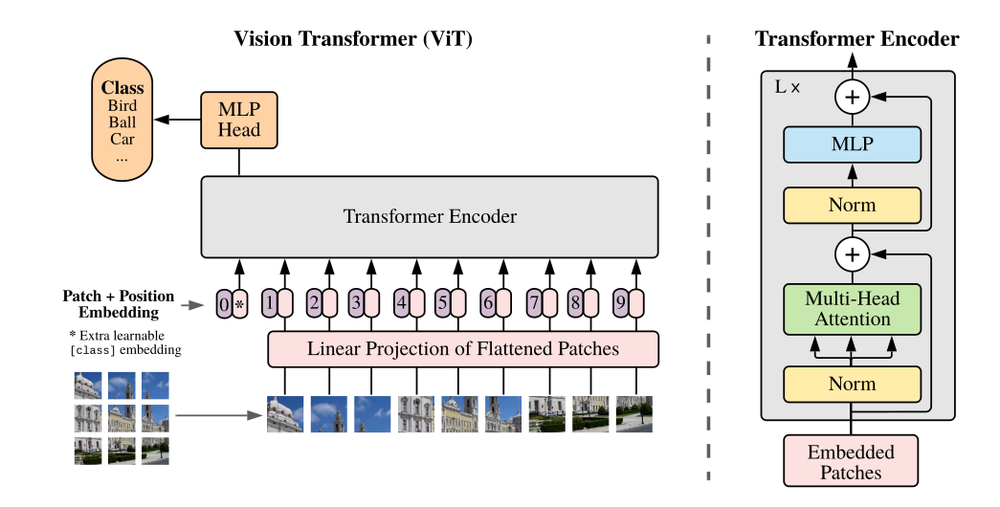
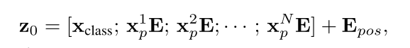

# Implement-16x16-ViT-Paper

Paper I'm implementing: [Dostovitskiy et al. 2021](https://arxiv.org/abs/2010.11929v2)

----

## Model overview

The Vision Transformer takes advantage of scalable architecture proposed in the original [Vaswani et al. 2017](https://arxiv.org/pdf/1706.03762) paper, while adapting it to the image classification tasks.

----
## The changes

1. Embedding flattened image patches instead of tokens.
2. Introduction of a class token added to the sequence of patches.

3. Layer norm is applied before MHSA and MLP blocks.

----

## Training

- The data used for pre-training
  - **ILSVRC-2012 ImageNet** dataset with 1k classes
and 1.3M images
  - **ImageNet-21k** with
21k classes and 14M images
  - **JFT** with 18k classes and
303M high-resolution images

The paper is implemented in code for educational purposes, so there is no trained weights.
